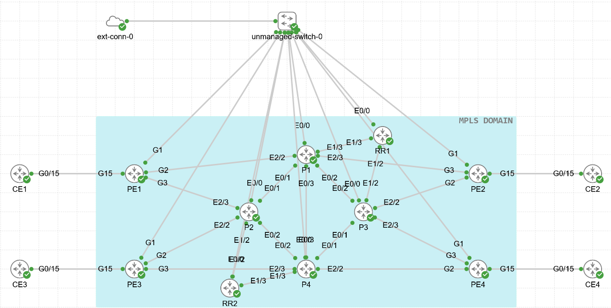

# Automated MPLS Service Provider Fabric

Python-driven automation that builds, deploys, and verifies an MPLS L3VPN service-provider core on Cisco IOS, from a single YAML source of truth to a fully peered BGP/LDP fabric.



## What this does

Point the scripts at a YAML file describing your routers and links, and they will:

1. Build the network adjacency matrix from the topology definition
2. Carve up an infrastructure `/24` into `/30` point-to-point subnets and assign them automatically
3. Generate per-router IOS configuration (hostname, loopback, OSPF, MPLS LDP, core interfaces)
4. Generate BGP configuration for a route-reflector design (RR1/RR2 with PE1-PE4 as clients)
5. Back up every router's existing config before touching anything
6. Push the generated configs over SSH with Netmiko
7. Save running-config to startup-config once the push is confirmed
8. Verify loopback-to-loopback reachability across the fabric

No manual CLI typing anywhere in the deployment path. Everything is generated from `Topology.yaml` and pushed programmatically.

## Topology

Ten routers: **P1-P4** (core/P routers), **PE1-PE4** (provider edge), **RR1-RR2** (BGP route reflectors). Core links run OSPF area 0 with MPLS LDP; PE and RR loopbacks peer over MP-iBGP with VPNv4 address families, RRs reflecting to the PE clients.

## Repo layout

| File | Role |
|---|---|
| `Topology.py` | Builds an adjacency matrix from `Topology.yaml` |
| `Addressing.py` | Splits the infra subnet into `/30`s and assigns interface IPs |
| `Configuration.py` | Generates IOS config (hostname, OSPF, LDP, interfaces) per router |
| `BGP_Setup.py` | Generates and pushes MP-iBGP / VPNv4 config for RRs and PE clients |
| `SP_Controller.py` | Orchestrator: runs the full build-and-deploy pipeline end to end |
| `Connection_Test.py` | Sanity-checks SSH reachability to P1 before doing anything else |
| `Backup_Routers.py` | Pulls and saves startup-config for every router before deployment |
| `Push_Routers.py` | Preflight-checks generated configs against backups, then pushes them |
| `Enable_PE_Interfaces.py` | Brings up Gi2/Gi3 on the PE routers |
| `Save_All_Routers.py` | Copies running-config to startup-config across the fabric |
| `Automated_Verification.py`, `Verify_LDP.py`, `Verify_Loopback_Reachability.py`, `Verify_All_Routers.py`, `Verify_Save_P1.py`, `Validate_Remaining_Routers.py` | Read-only checks: OSPF neighbor state, LDP session state, end-to-end loopback pings, config validation |
| `Topology.example.yaml` | Template source-of-truth file, safe to commit |
| `INITAL CONFIG.txt` | Bootstrap CLI steps to get SSH access on a fresh CML router before the automation takes over |

## Requirements

- Python 3
- [Netmiko](https://github.com/ktbyers/netmiko) for SSH
- PyYAML
- Cisco Modeling Labs (or equivalent) running Cisco IOS/IOS XE

```bash
python3 -m venv .venv
source .venv/bin/activate
pip install netmiko pyyaml
```

## Usage

1. Copy `Topology.example.yaml` to `Topology.yaml` and fill in real management IPs, loopbacks, interface mappings, and credentials. `Topology.yaml` is gitignored, so real credentials never get committed.
2. Confirm SSH reachability:
   ```bash
   python3 Connection_Test.py
   ```
3. Run the full pipeline:
   ```bash
   python3 SP_Controller.py
   ```
   This generates configs into `generated_configs/`, backs up every router into `backups/`, pushes the configs, saves them, and runs loopback verification. Review `generated_configs/` before confirming any push.
4. Individual scripts (`Push_Routers.py`, `Save_All_Routers.py`, etc.) can be run standalone if you want to step through the process manually instead of the full orchestrated run.

## Safety notes

- `Push_Routers.py` refuses to run unless a backup already exists for every router, and it blocks configs that touch the management interface.
- Both the config push and the save-to-startup step require typing `PUSH ALL` / `SAVE ALL` at a prompt before anything changes on the routers.
- `Topology.yaml`, `generated_configs/`, `backups/`, and `verification_reports/` are all gitignored. Never commit real credentials or router state.

## Status

The MPLS/OSPF underlay and MP-iBGP overlay are both scripted and verified end to end. This is a personal networking lab project built for JNCIE-SP style practice, not production code, credentials and error handling are minimal by design for lab use.